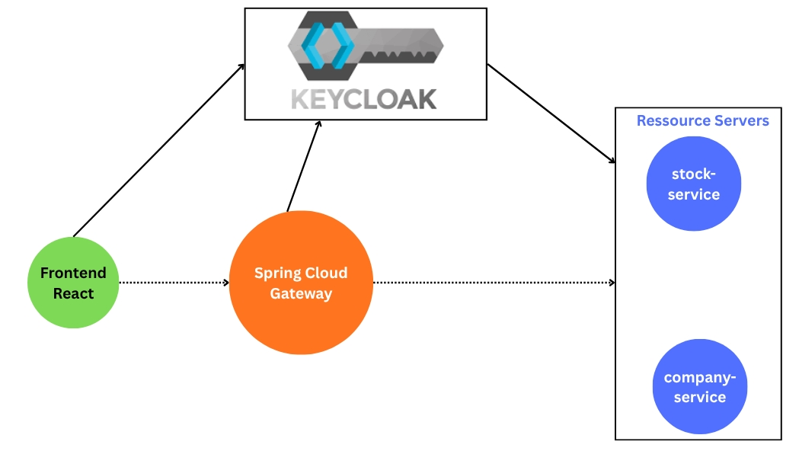

# Microservices Sécurisés - Architecture Spring Boot, React & Keycloak

Ce projet démontre une architecture microservices sécurisée utilisant Spring Boot, React et Keycloak.

## 📋 Architecture du Projet



## 🏗️ Composants

### 1. **Keycloak** - Gestion d'identité et d'accès
- Serveur d'authentification et d'autorisation
- Gestion des utilisateurs, rôles et permissions
- Intégration OAuth2/OpenID Connect

### 2. **Frontend (React)**
- Interface utilisateur développée avec React
- Intégration avec Keycloak pour l'authentification
- Communication avec les microservices via l'API Gateway

### 3. **Spring Cloud Gateway**
- Point d'entrée unique pour toutes les requêtes API
- Routage vers les services appropriés
- Gestion du CORS et des en-têtes
- Intégration de la sécurité

### 4. **Microservices Backend**
- **stock-service** : Gestion des données stock
- **company-service** : Gestion des données entreprises
- Chaque service est indépendant et sécurisé

## 🚀 Démarrage Rapide

### Prérequis
- Java 17+
- Node.js 16+
- Docker & Docker Compose
- Maven

### Installation

1. **Cloner le dépôt :**
```bash
git clone https://github.com/chaymaAitB/Devoir-D-veloppement-d-une-application-micro-services-s-curis-e-Spring-Boot-React-Keycloak
```

2. **Démarrer Keycloak :**
```bash
docker-compose up keycloak
```

3. **Démarrer les services backend :**
```bash
mvn spring-boot:run
```

4. **Démarrer le frontend :**
```bash
cd frontend
npm install
npm start
```

## 🔧 Configuration

### Keycloak
- URL : `http://localhost:8080`
- Realm : `microservices-realm`
- Client : `react-frontend`

### Services
- API Gateway : `http://localhost:8081`
- Stock Service : `http://localhost:8082`
- Company Service : `http://localhost:8083`

### Frontend
- URL : `http://localhost:3000`

## 📄 Documentation API

La documentation Swagger est disponible après démarrage :
- Chaque service expose sa propre documentation
